<div align="center">

# 🔐 SecureLoop

**The first AI security tool that closes the full loop.**

`write → scan → fix → ship → verify`

[](https://python.org)
[](https://kotlinlang.org)
[](https://nextjs.org)
[](https://openai.com)

*Built at JetBrains Codex Hackathon 2026 — San Francisco*

</div>

---

## The Problem

Security tools today are silos. Snyk scans your dependencies. SonarQube flags your code. Sentry catches your production crashes. None of them talk to each other, and none of them close the loop.

A developer gets a Sentry alert at 2am. They copy the stack trace into a chat window, ask an AI separately, write a fix manually, open a PR manually — and have no idea if the fix actually held in production. The loop never closes.

**SecureLoop connects all of that — inside your IDE, with a human in the loop before anything ships.**

---

## What We Built



SecureLoop is a JetBrains plugin backed by an AI agent. It takes a production error from Sentry, maps it to the exact line in your local code, classifies the vulnerability against OWASP and CWE standards, generates a patch using Codex, and presents it to the developer for approval — before a single line changes. Once approved, it opens a GitHub PR with the full diagnosis attached.

### The Five Modules

**Module 1 — Secure Code Generation**
As you write code, `Alt+Enter` calls Codex with your project's own security policy to suggest secure completions inline. Not generic suggestions — policy-aware ones, specific to what your team has defined as acceptable.

**Module 2 — Vulnerable Code Checker**
On every file save, the plugin scans the file and classifies any vulnerability by severity (Critical / High / Medium / Low), CWE ID, and OWASP category. Critical and High findings are highlighted directly in the editor gutter so you see them before you commit.

**Module 3 — Dependency Checker**
Audits your `requirements.txt` against known CVEs. The result isn't just displayed — it's fed directly back into the Codex fix prompt, so the generated patch is version-aware. It won't tell you to use a method that doesn't exist in your currently installed library.

**Module 4 — Remediation + Human Approval Gate**
Codex generates a step-by-step fix plan and a unified diff. The developer sees the severity, the CWE, the attack scenario, and exactly what will change. One click to Approve — patch applied, PR opened. One click to Reject — reason logged for policy improvement. Nothing touches the codebase without eyes on it.

**Module 5 — Production Verification via Sentry** *(roadmap)*
After a fix merges, SecureLoop watches Sentry for the same CWE class re-appearing within 48 hours. If it does, the fix is flagged as incomplete, severity is escalated, and the loop re-enters at Module 2 with the real production stack trace.

---

## The Cybersecurity Constitution

At the core of every Codex decision is `security-policy.md` — a structured policy file that lives in your repo root and acts as the ground truth for all AI-generated security analysis and fixes.

Think of it like `robots.txt`, but for security. Just as `robots.txt` became the standard baseline file for how AI agents should interact with any website, `security-policy.md` is the baseline for how AI should reason about security in any codebase.

It defines:
- Which CWEs are always rated Critical regardless of context
- Banned patterns (string concatenation in SQL, hardcoded secrets, etc.)
- Required patterns (bcrypt cost factor, parameterized queries, secrets via env vars)
- Approved libraries for security-sensitive operations
- Compliance scope — which endpoints are GDPR or PCI-DSS bound
- Acceptable risk and deferral rules

Every Codex call in SecureLoop is constrained by this file. If the policy says bcrypt minimum cost 12, no AI suggestion will deviate from that — even if generic OWASP guidance would allow something weaker. The policy wins.

This is the broader idea: **every software product being built today should ship with a `security-policy.md` as a standard file, the same way they ship with a `README` or a `.gitignore`.** It gives AI tools a grounded, org-specific set of rules to reason against instead of generic internet advice.

---

## How It Works End-to-End

There are two entry points into SecureLoop. Both converge at the same diagnosis and remediation flow.

**Entry Point A — While writing code (proactive)**
```
Developer writes code in JetBrains IDE
        ↓
Alt+Enter triggers SecureLoopIntentionAction
        ↓
Plugin sends selected code + security-policy.md to agent /ide/generate
        ↓
Codex returns policy-aware secure completion — inserted inline
        ↓
On file save → SecureLoopSaveListener fires
        ↓
Full file sent to agent /ide/analyze-file
        ↓
Codex scans for vulnerabilities → severity · CWE · OWASP classification returned
        ↓
Critical or High findings → gutter icon highlighted in editor before commit
```

**Entry Point B — From a production error (reactive)**
```
Runtime error hits production → Sentry captures it
        ↓
Sentry fires signed webhook → agent /sentry/webhook (HMAC verified)
        ↓
Agent stores incident in SQLite · broadcasts via SSE stream
        ↓
JetBrains plugin receives incident over /ide/events/stream
        ↓
Plugin maps stack trace file path + line number to open project file
        ↓
Affected line highlighted in editor · tool window activates
```

**Both paths converge here — the diagnosis and fix loop**
```
Developer clicks Analyze with Codex in tool window
        ↓
Plugin sends to agent /ide/analyze:
  → stack trace or flagged source
  → 40-line source window around the vulnerability
  → security-policy.md loaded from repo root
        ↓
Agent runs Module 3 in parallel: /ide/scan-deps
  → requirements.txt audited against known CVEs
  → vulnerable packages + fix versions returned
        ↓
Codex Call 1 — Diagnosis:
  → severity · CWE ID · OWASP category
  → attack scenario · evidence · policy violations
        ↓
Codex Call 2 — Fix generation (dep-aware):
  → patch diff using required patterns from security-policy.md
  → version bump included if dep vulnerability found
  → PR title + PR body generated
        ↓
Full diagnosis rendered in IDE tool window:
  severity badge · CWE tag · fix plan · unified diff
        ↓
Dashboard at localhost:3000 shows incident as "Action Required"
        ↓
    ┌── Approve → WriteCommandAction applies patch live in editor
    │             → /ide/open-pr creates GitHub PR with full diagnosis
    │             → Dashboard moves incident to "Resolution History"
    │
    └── Reject  → reason captured via /ide/reject-fix
                  → logged for security-policy.md tuning
        ↓
Post-merge: Sentry monitored for same CWE recurrence
If same class of error re-fires within 48 hours →
  severity escalated · loop re-enters at Entry Point B
```

---

## What Makes This Different

Every existing tool stops at detection. SecureLoop is the first tool that operates in the **consequence layer** — where real errors hit real users — and closes the loop from that point all the way back to a verified fix.

| Tool | What it does | Where it stops |
|------|-------------|----------------|
| Snyk | Scans dependencies for CVEs | Shows you a dashboard |
| SonarQube | Flags vulnerable code patterns | Shows you a list |
| Sentry | Catches production errors | Shows you a stack trace |
| **SecureLoop** | Connects all of the above | Fixes it · ships it · verifies it held |

---

## Project Structure

```
JBHack/
├── apps/
│   ├── agent/                  # Python FastAPI — the AI brain
│   │   └── src/
│   │       ├── codex_client.py     # Codex API integration
│   │       ├── prompt_builder.py   # Security-policy-aware prompt construction
│   │       ├── validator.py        # AI response validation + severity enforcement
│   │       ├── policy_loader.py    # Loads security-policy.md from repo root
│   │       └── storage.py          # Incident store + SSE broker
│   │
│   ├── dashboard/              # Next.js — incident queue + lifecycle view
│   │
│   ├── jetbrains-plugin/       # Kotlin — the IDE plugin
│   │   └── src/main/kotlin/dev/secureloop/plugin/
│   │       ├── SecureLoopSaveListener.kt       # Module 2: on-save scan
│   │       ├── SecureLoopIntentionAction.kt    # Module 1: Alt+Enter completions
│   │       ├── SecureLoopToolWindowPanel.kt    # Approve / Reject UI
│   │       └── SecureLoopProjectService.kt     # Incident state + remediation
│   │
│   └── target/                 # Intentionally vulnerable demo app
│
├── security-policy.md          # The Cybersecurity Constitution
└── secureloop_plugin_vision.svg
```

---

## Quick Start

```bash
git clone https://github.com/PeytonLi/JBHack.git
cd JBHack && git checkout Rahul

pnpm install
cp .env.example .env          # add your OPENAI_API_KEY
pnpm dev                      # starts agent (8001) + target (8000) + dashboard (3000)

cd apps/jetbrains-plugin
./gradlew runIde               # launches sandbox IDE with plugin loaded
```

In the sandbox IDE: open the SecureLoop tool window → click **Run Demo** → watch the full loop run on a live vulnerable endpoint.

---

## Environment Variables

| Variable | Purpose |
|----------|---------|
| `OPENAI_API_KEY` | Required for all Codex analysis and fix generation |
| `SENTRY_DSN` | Connect your Sentry project for real production alerts |
| `SENTRY_AUTH_TOKEN` | Fetch full event payloads from Sentry API |
| `GITHUB_TOKEN` | Open PRs automatically on approval |
| `GITHUB_REPO` | `owner/repo` target for PR creation |
| `SECURE_LOOP_ALLOW_DEBUG_ENDPOINTS` | Set to `1` for demo mode without live Sentry |

---

## The Vision

SecureLoop started as a hackathon project to prove a single idea: **AI security tooling should operate in a closed loop, not as isolated scanners.**

The immediate product is a JetBrains plugin. But the broader idea is a standard.

Today, `robots.txt` is a universal baseline — every website ships one so AI crawlers know the rules. There is no equivalent for security. No standard file that tells AI coding tools: here are the rules for this codebase, here are the banned patterns, here is what we consider Critical, here is what our team has decided is acceptable risk.

`security-policy.md` is a proposal for that standard. A file that lives in every repo root, version-controlled like any other dependency, reviewed by the security team, and consumed by every AI tool that touches the codebase.

The full automated cycle — write → scan → fix → ship → verify — is what SecureLoop is being built toward. The human approval gate is not a temporary limitation. It's the design. Security decisions carry consequences that AI should surface and humans should own.

---

## Team

Built at **JetBrains Codex Hackathon 2026** in San Francisco.

| | |
|--|--|
| **Abhiram Sribhashyam** | Agent backend | Codex integration | module architecture |
| **Rahul Marri** | Dashboard & Frontend | Vulnerable code checker | security-policy.md | OWASP & CWE integration |
| **Peyton Li** | JetBrains plugin | Sentry ingestion | SSE streaming |

---

<div align="center">

*"Snyk scans deps. SonarQube flags code. Sentry catches errors. None of them talk to each other."*

**SecureLoop does. And it closes the loop.**

</div>
